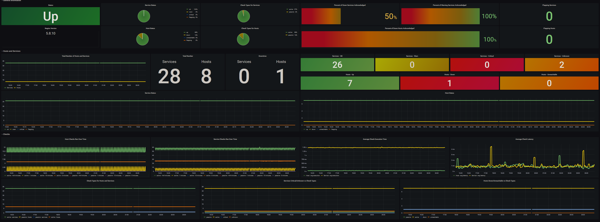

<p align="center">
  
</p>

# nagios_exporter


[](https://github.com/wbollock/nagios_exporter/blob/master/LICENSE)
[](https://github.com/wbollock/nagios_exporter/actions/workflows/golangci-lint.yaml)

[](https://github.com/wbollock/nagios_exporter/issues)

A Prometheus exporter currently supporting:

* Nagios XI
* Nagios Core 4
* Nagios Core 3
* CheckMK

It includes metrics on the current state and configuration of Nagios. This includes the number of hosts, services, and information about their monitoring setup. For example, this exporter will output the number of flapping hosts, passive checks, or hosts in downtime.

Practical use cases for this exporter may include:

* A Nagios overview - see broad status of hosts and services
* Visualize changes in host status after making adjustments to Nagios checks
* Detect an uptick in `unknown` check results after converting many active checks to passive

This exporter does not output Nagios check results as Prometheus metrics; it is designed to export metrics of the Nagios monitoring server itself for meta-monitoring.

## Table of Contents

- [nagios\_exporter](#nagios_exporter)
  - [Table of Contents](#table-of-contents)
  - [Installation](#installation)
    - [Debian/RPM package](#debianrpm-package)
    - [Docker](#docker)
    - [Binary](#binary)
    - [Source](#source)
  - [Configuration](#configuration)
    - [Configuration File](#configuration-file)
    - [CLI](#cli)
    - [Nagios Core 3/4 support](#nagios-core-34-support)
  - [Metrics](#metrics)
  - [Grafana](#grafana)
  - [Troubleshooting](#troubleshooting)
    - [NagiosXI](#nagiosxi)
    - [Nagios Core 3/4, CheckMK](#nagios-core-34-checkmk)
  - [Resources Used](#resources-used)
  - [Contributing](#contributing)
  - [Releasing](#releasing)
  - [Contributors ✨](#contributors-)

## Installation

### Debian/RPM package

Substitute `{{ version }}` for your desired release.

```bash
wget https://github.com/wbollock/nagios_exporter/releases/download/v{{ version }}/prometheus-nagios-exporter_{{ version }}_linux_amd64.{deb,rpm}
{dpkg,rpm} -i prometheus-nagios-exporter_{{ version }}_linux_amd64.{deb,rpm}
```

### Docker

Populate `config.toml` with your `APIKey = NagiosXIAPIKey`

```console
sudo docker run \
-v ./config.toml:/etc/prometheus-nagios-exporter/config.toml \
ghcr.io/wbollock/nagios_exporter \
--nagios.scrape-uri http://localhost
```

### Binary

```bash
wget https://github.com/wbollock/nagios_exporter/releases/download/v{{ version }}/nagios_exporter_{{ version }}_Linux_x86_64.tar.gz
tar xvf nagios_exporter_{{ version }}_Linux_x86_64.tar.gz
./nagios_exporter/prometheus-nagios-exporter
```

### Source

```bash
wget https://github.com/wbollock/nagios_exporter/archive/refs/tags/v{{ version }}.tar.gz
tar xvf nagios_exporter-{{ version }}.tar.gz
cd ./nagios_exporter-{{ version }}
go build nagios_exporter.go
./nagios_exporter.go
```

## Configuration

Create a simple `config.toml` in `/etc/prometheus-nagios-exporter` with your Nagios API key:

```toml
# prometheus-nagios-exporter configuration

APIKey = ""
```

### Configuration File

In TOML format.

| Environment Variable         | Description                                                     | Default   | Required |
|:----------------------------:|-----------------------------------------------------------------|-----------|:--------:|
| `APIKey`                     | The NagiosXI API key if exporting NagiosXI api-specific metrics |           | ❌       |

### CLI

To see all available configuration flags:

```bash
./prometheus-nagios-exporter -h
```

| CLI Flag                       | Description                                                    | Default   | Required |
|:------------------------------:|----------------------------------------------------------------|-----------|:--------:|
| `---config.path`               | Configuration file path, only for API key | /etc/prometheus-nagios-exporter/config.toml           | ❌        |
| `--log.level`               | Minimum log level like "debug" or "info"           |   info | ❌        |
| `--nagios.check-updates`               | Enable optional `nagios_update_available_info` metric         |   false        | ❌       |
| `--nagios.config_path`            | Nagios configuration path for use with nagiostats binary                           |    `/usr/local/nagios/etc/nagios.cfg`     | ❌       |
| `--nagios.scrape-uri`           | Nagios application address to scrape     |   `http://localhost    `    | ❌       |
| `--nagios.ssl-verify`       | SSL certificate validation                      | false | ❌       |
| `--nagios.stats_binary`         | Path of nagiostats binary and configuration (e.g `/usr/local/nagios/bin/nagiostats`)                |   | ❌       |
| `--nagios.timeout`        | Timeout for querying Nagios API in seconds  (on big installations I recommend ~60)                     |     `5`       | ❌       |
| `--web.listen-address`        |Address to listen on for telemetry (scrape port)                                |   `9927`        | ❌       |
| `--web.telemetry-path`  | Path under which to expose metrics | `/metrics`   | ❌       |

### Nagios Core 3/4 support

This exporter also supports Nagios Core 3/4 and CheckMK, albeit with a subset of metrics and reliance on the `nagiosstats` binary. There is no RESTful API for either monitoring platform, so the exporter must be run directly on the Nagios host and have access to execute `nagiostats`.

It is also recommended to pass the path of the Nagios configuration

Typical location and usage of the binary:

* Nagios Core 3/4:
  * `--nagios.stats_binary`: `/usr/local/nagios/bin/nagiostats`
  * `--nagios.config_path`: `/usr/local/nagios/etc/nagios.cfg`
* CheckMK:
  * `--nagios.stats_binary`: `/omd/sites/<your-site>/bin/nagiostats`
  * `--nagios.config_path`: `/omd/sites/<your-site>/tmp/nagios/nagios.cfg`

Example usage:

```bash
./nagios_exporter --nagios.stats_binary "/usr/local/nagios/bin/nagiostats" --nagios.config_path "/usr/local/nagios/etc/nagios.cfg"
```

Note that this flag nullifies all others. It cannot be used in conjunction with the Nagios XI API.

## Metrics

<details close>

  <summary>Click to expand metrics</summary>

| Metric Name                       | Description                                          | Type      |
|:--------------------------------:|:----------------------------------------------------:|:---------:|
| `nagios_build_info`               | Nagios exporter build information                    | gauge     |
| `nagios_host_checks_execution`    | Host check execution                                 | histogram |
| `nagios_host_checks_latency`      | Host check latency                                   | histogram |
| `nagios_host_checks_minutes`      | Host checks over time                                | histogram |
| `nagios_host_checks_performance_seconds` | Host checks performance                      | gauge     |
| `nagios_hosts_acknowledges_total` | Amount of host problems acknowledged                 | gauge     |
| `nagios_hosts_checked_total`      | Amount of hosts checked                              | gauge     |
| `nagios_hosts_downtime_total`     | Amount of hosts in downtime                          | gauge     |
| `nagios_hosts_status_total`       | Amount of hosts in different states                  | gauge     |
| `nagios_hosts_total`              | Amount of hosts present in configuration             | gauge     |
| `nagios_service_checks_execution` | Service check execution                              | histogram |
| `nagios_service_checks_latency`   | Service check latency                                | histogram |
| `nagios_service_checks_minutes`   | Service checks over time                             | histogram |
| `nagios_service_checks_performance_seconds` | Service checks performance               | gauge     |
| `nagios_services_acknowledges_total` | Amount of service problems acknowledged         | gauge     |
| `nagios_services_checked_total`   | Amount of services checked                           | gauge     |
| `nagios_services_downtime_total`  | Amount of services in downtime                       | gauge     |
| `nagios_services_status_total`    | Amount of services in different states               | gauge     |
| `nagios_services_total`           | Amount of services present in configuration          | gauge     |
| `nagios_up`                       | Whether Nagios can be reached                         | gauge     |
| `nagios_update_available_info`    | NagiosXI update is available (optional metric!)                          | gauge     |
| `nagios_users_privileges_total`   | Amount of admin or regular users                      | gauge     |
| `nagios_users_status_total`       | Amount of disabled or enabled users                   | gauge     |
| `nagios_users_total`              | Amount of users present on the system                 | gauge     |
| `nagios_version_info`             | Nagios version information                            | gauge     |

`nagios_update_available_info` is optional because the user may not want their Nagios server scraping the external version webpage every `scrape_interval`.

</details>

## Grafana

Import the [dashboard](grafana/dashboard.json) template ([instructions](https://grafana.com/docs/grafana/v9.0/dashboards/export-import/#import-dashboard)).

 

## Troubleshooting

Ensure `nagios_up` returns `1`.

### NagiosXI

Please check your API key and Nagios reachability:

```bash
curl -GET "http://<nagios_url>/nagiosxi/api/v1/objects/host?apikey=<apikey>&pretty=1"
```

### Nagios Core 3/4, CheckMK

Ensure the user running the Nagios Exporter can execute `nagiostats` fully:

```bash
sudo su <prometheus-user> -s /bin/bash -c "/usr/local/nagios/bin/nagiostats -c /usr/local/nagios/etc/nagios.cfg"
```

## Resources Used

* [haproxy_expoter](https://github.com/prometheus/haproxy_exporter/blob/main/haproxy_exporter.go)
* [15 Steps to Write an Application Prometheus Exporter in GO](https://medium.com/teamzerolabs/15-steps-to-write-an-application-prometheus-exporter-in-go-9746b4520e26)
* [curl-to-go](https://mholt.github.io/curl-to-go/)
* [mirth_exporter](https://github.com/teamzerolabs/mirth_channel_exporter)
* [golang-json-api-client](https://blog.alexellis.io/golang-json-api-client/)
* [jsonutils](https://github.com/bashtian/jsonutils)
* [goreleaser](https://github.com/goreleaser/goreleaser)
* [nfpm](https://github.com/goreleaser/nfpm)

## Contributing

To build and run the Debian package, install go-releaser and run:

```bash
goreleaser release --clean --snapshot
# currently I develop on a VM running NagiosXI, but a container would be cool too
scp dist/prometheus-nagios-exporter_1.2.2-next_linux_386.deb root@<nagiosXI-VM-ip>:/root/
dpkg -i prometheus-nagios-exporter_1.2.2-next_linux_amd64.deb
# examine metrics
ssh root@<nagiosXI-VM-ip>
curl -s localhost:9927/metrics | grep "^nagios"
```

Install pre-commit hooks:

```console
pre-commit install
```

## Releasing

Follow goreleaser's [quick start](https://goreleaser.com/quick-start/) instructions.

```bash
# make changes, merge into main
export GITHUB_TOKEN="YOUR_GH_TOKEN"
git tag -a v<semver> -m "Release summary"
git push origin v<semver>
# login to ghcr too
# https://docs.github.com/en/packages/working-with-a-github-packages-registry/working-with-the-container-registry#authenticating-with-a-personal-access-token-classic
echo $CR_PAT | docker login ghcr.io -u $USERNAME --password-stdin

goreleaser release
```

## Contributors ✨

<!-- ALL-CONTRIBUTORS-LIST:START - Do not remove or modify this section -->
<!-- prettier-ignore-start -->
<!-- markdownlint-disable -->
<table>
  <tbody>
    <tr>
      <td align="center"><a href="https://github.com/tjhop"><br /><sub><b>TJ Hoplock</b></sub></a><br /><a href="https://github.com/wbollock/nagios_exporter/commits?author=tjhop" title="Code">💻</a> <a href="#mentoring-tjhop" title="Mentoring">🧑‍🏫</a></td>
    </tr>
  </tbody>
</table>

<!-- markdownlint-restore -->
<!-- prettier-ignore-end -->

<!-- ALL-CONTRIBUTORS-LIST:END -->

This project follows the [all-contributors](https://github.com/all-contributors/all-contributors) specification.
